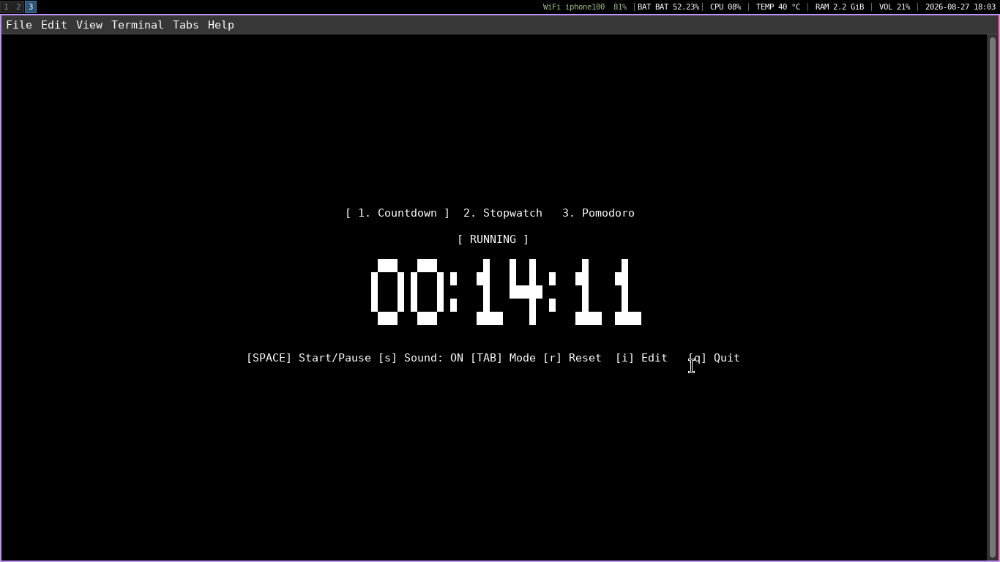

# ⏱️ tick

> A lightweight, feature-rich terminal countdown, stopwatch, and pomodoro timer with organic mechanical clock ticks and big ASCII art visuals. Written in pure C (POSIX compliant) using `ncurses`.

[](https://www.gnu.org/licenses/gpl-3.0)
[](https://en.wikipedia.org/wiki/C11_(C_standard_revision))
[](https://www.kernel.org)

---

## ✨ Features

* **3 Operating Modes:**
  * ⏳ **Countdown Timer:** Precise countdown with alarm when time expires.
  * ⏱️ **Stopwatch:** Count-up timer for tracking task duration.
  * 🍅 **Pomodoro Engine:** Classic 4-cycle state machine (`Focus 25m` ➡️ `Short Break 5m` ➡️ `Long Break 15m`).
* **Interactive In-Place Editor (`[i]`):** Direct keypad/digit replacement editor without annoying popup modals.
* **Organic Mechanical Audio:** Non-blocking clock tick sound effects randomized across multiple recordings, plus an alarm sound on completion.
* **Visual Flash Alert:** Terminal flash trigger on time expiration (great for muted environments).
* **Responsive TUI:** Dynamic true horizontal & vertical centering with terminal resize safety guard.
* **Zero Bloat & Zero Zombies:** Strict POSIX `CLOCK_MONOTONIC` timekeeping with automated child process reaping.

---

## 📸 Preview



---

## 📦 Dependencies

Ensure the following packages are installed on your Linux system:

| Distro | Command |
|---|---|
| **Debian / Ubuntu / Linux Mint** | `sudo apt install build-essential libncursesw5-dev alsa-utils` |
| **Arch Linux / Manjaro** | `sudo pacman -S base-devel ncurses alsa-utils` |
| **Fedora / RHEL** | `sudo dnf install gcc make ncurses-devel alsa-utils` |
| **Void Linux** | `sudo xbps-install -S base-devel ncurses-devel alsa-utils` |

---

## 🛠️ Building & Installation

### Build from Source
```bash
git clone https://github.com/alirezanose/tick.git
cd tick
make
```

### Run Locally
```bash
./build/tick
```

### Install Globally
```bash
sudo make install PREFIX=/usr
```
*Binary will be installed to `/usr/bin/tick` and sound assets to `/usr/share/tick/sounds/`.*

### Uninstall
```bash
sudo make uninstall PREFIX=/usr
```

---

## ⌨️ Keybindings

| Key | Mode | Action |
|---|---|---|
| **`[SPACE]`** | Normal | Start / Pause timer |
| **`[TAB]`** | Normal | Cycle modes (Countdown ➡️ Stopwatch ➡️ Pomodoro) |
| **`[1]`, `[2]`, `[3]`** | Normal | Jump directly to specific mode tab |
| **`[r]`** | Normal | Reset timer to initial state / pomodoro start |
| **`[i]`** | Normal | Enter in-place edit mode (`[ EDIT TIME ]`) |
| **`[s]`** | Normal | Toggle sound mute on / off (`[ Sound: ON / OFF ]`) |
| **`[↑] / [↓]`** | Normal | Quick adjust `+/- 5s` |
| **`[0-9]`** | Edit Mode | Type digit directly into active cursor position |
| **`[←] / [→]`** | Edit Mode | Move digit cursor |
| **`[Backspace]`**| Edit Mode | Move cursor backward |
| **`[ENTER]`** | Edit Mode | Save edited duration & return to Normal mode |
| **`[ESC]` / `[q]`**| Edit Mode | Cancel editing without saving |
| **`[q]`** | Normal | Quit application |

---

## 📄 License

This project is licensed under the **GNU General Public License v3.0 (GPLv3)**. See the [LICENSE](LICENSE) file for details.
