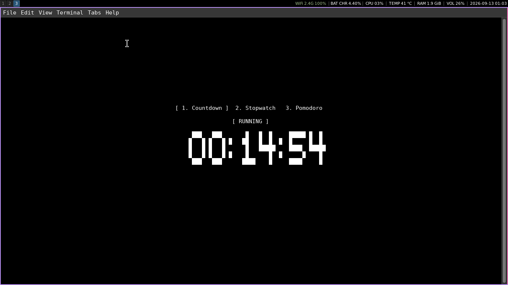
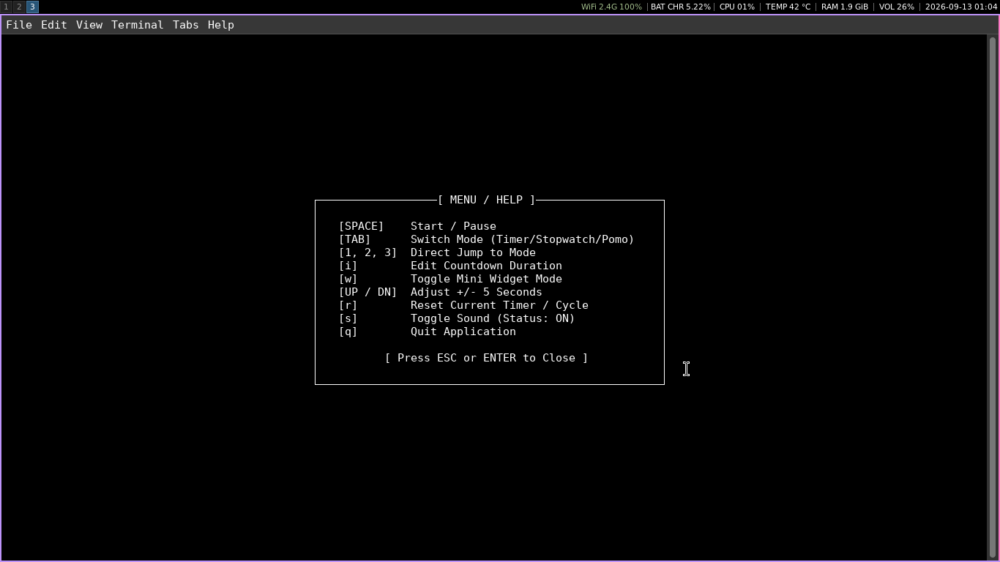
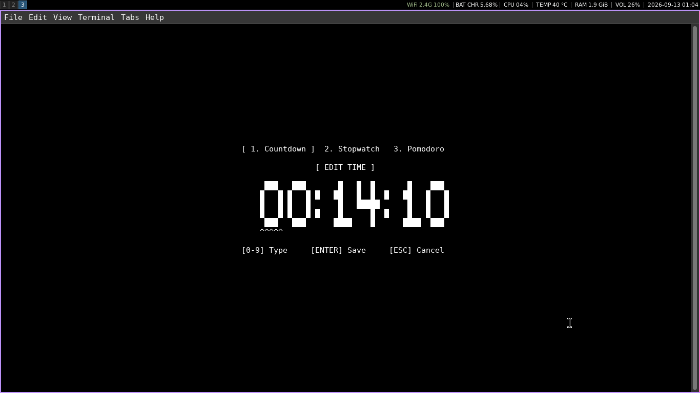
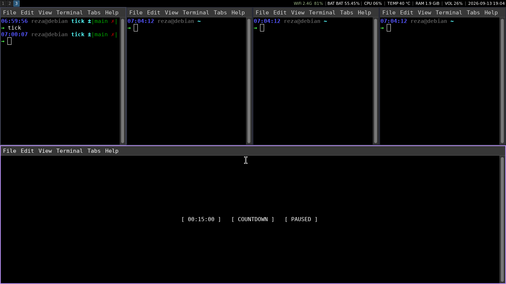

# ⏱️ tick

> A lightweight, feature-rich terminal countdown, stopwatch, and pomodoro timer with organic mechanical clock ticks and big ASCII art visuals. Written in pure C (POSIX compliant) using `ncurses`.

[](https://www.gnu.org/licenses/gpl-3.0)
[](https://en.wikipedia.org/wiki/C11_(C_standard_revision))
[](https://www.kernel.org)

---

## ✨ Features

* **3 Operating Modes:**
  * ⏳ **Countdown Timer:** Precise countdown with alarm when time expires.
  * ⏱️ **Stopwatch:** Count-up timer for tracking task duration.
  * 🍅 **Pomodoro Engine:** Classic 4-cycle state machine (`Focus 25m` ➡️ `Short Break 5m` ➡️ `Long Break 15m`).
* **Clean Zen UI & Modal Menu (`[m]` / `[ESC]`):** Distraction-free clock screen with btop-inspired centered modal menu.
* **Mini Widget Mode (`[w]`):** Ultra-compact 1-line layout (`[ HH:MM:SS ] [ MODE ] [ STATUS ]`) perfect for terminal splits or small windows.
* **CLI Power-User Support:** Start directly with natural durations like `tick 25m`, `tick 1h30m`, `tick -s`, or `tick -p`.
* **Interactive In-Place Editor (`[i]`):** Direct digit replacement editor without popups.
* **Desktop Notifications:** Desktop alerts via `notify-send` when countdowns finish or pomodoro phases shift.
* **Configuration File:** Customizable preferences auto-generated at `~/.config/tick/config.ini`.
* **Organic Mechanical Audio:** Non-blocking clock tick sound effects randomized across multiple recordings, plus an alarm on completion.
* **Visual Flash Alert:** Terminal flash trigger on time expiration (great for muted environments).
* **Responsive TUI:** Dynamic true horizontal & vertical centering with terminal resize guard.
* **Zero Bloat & Zero Zombies:** Strict POSIX `CLOCK_MONOTONIC` timekeeping with automated child process reaping.

---

## 📸 Preview

| Main Zen Interface | Modal Help Menu (`[m]`) |
|:---:|:---:|
|  |  |

| In-Place Time Editor (`[i]`) | Mini Widget Mode (`[w]`) |
|:---:|:---:|
|  |  |

---

## 🚀 CLI Usage

```bash
# Start with default countdown (or config default)
tick

# Start countdown with natural duration format
tick 25m
tick 1h30m
tick 90s
tick 1h20m15s

# Start directly in stopwatch mode
tick -s
tick --stopwatch

# Start directly in pomodoro mode
tick -p
tick --pomodoro

# Show help or version
tick -h
tick -v
```

---

## 📦 Dependencies

Ensure the following packages are installed on your Linux system:

| Distro | Command |
|---|---|
| **Debian / Ubuntu / Linux Mint** | `sudo apt install build-essential libncursesw5-dev alsa-utils libnotify-bin` |
| **Arch Linux / Manjaro** | `sudo pacman -S base-devel ncurses alsa-utils libnotify` |
| **Fedora / RHEL** | `sudo dnf install gcc make ncurses-devel alsa-utils libnotify` |
| **Void Linux** | `sudo xbps-install -S base-devel ncurses-devel alsa-utils libnotify` |

*(Note: `libnotify` / `notify-send` is optional, used for desktop popup notifications).*

---

## 🛠️ Building & Installation

### Build from Source
```bash
git clone https://github.com/alirezanose/tick.git
cd tick
make
```

### Run Locally
```bash
./build/tick
```

### Install Globally
```bash
sudo make install PREFIX=/usr
```
*Binary will be installed to `/usr/bin/tick` and sound assets to `/usr/share/tick/sounds/`.*

### Uninstall
```bash
sudo make uninstall PREFIX=/usr
```

---

## ⚙️ Configuration

On first launch, `tick` automatically creates a default config file at:
`~/.config/tick/config.ini`

You can customize your preferred default mode, sounds, and durations:
```ini
# Valid modes: countdown, stopwatch, pomodoro
default_mode = countdown

# Sound ticks and alarm: true or false
sound = true

# Desktop notifications: true or false
notification = true

# Default countdown duration
countdown_duration = 5m

# Pomodoro durations
pomo_focus = 25m
pomo_short_break = 5m
pomo_long_break = 15m
```

---

## ⌨️ Keybindings

| Key | Mode | Action |
|---|---|---|
| **`[SPACE]`** | Normal | Start / Pause timer |
| **`[TAB]`** | Normal | Cycle modes (Countdown ➡️ Stopwatch ➡️ Pomodoro) |
| **`[1]`, `[2]`, `[3]`** | Normal | Jump directly to specific mode tab |
| **`[w]`** | Normal | Toggle Mini Widget Mode (Compact 1-line) |
| **`[m] / [ESC]`** | Normal | Open / Close Modal Help Menu |
| **`[r]`** | Normal | Reset timer to initial state / pomodoro start |
| **`[i]`** | Normal | Enter in-place edit mode (`[ EDIT TIME ]`) |
| **`[s]`** | Normal | Toggle sound mute on / off (`[ Sound: ON / OFF ]`) |
| **`[↑] / [↓]`** | Normal / Edit | Quick adjust `+/- 5s` |
| **`[0-9]`** | Edit Mode | Type digit directly into active cursor position |
| **`[←] / [→]`** | Edit Mode | Move digit cursor |
| **`[Backspace]`**| Edit Mode | Move cursor backward |
| **`[ENTER]`** | Edit Mode | Save edited duration & return to Normal mode |
| **`[ESC]` / `[q]`**| Edit Mode | Cancel editing without saving |
| **`[q]`** | Normal | Quit application |

---

## 📄 License

This project is licensed under the **GNU General Public License v3.0 (GPLv3)**. See the [LICENSE](LICENSE) file for details.
